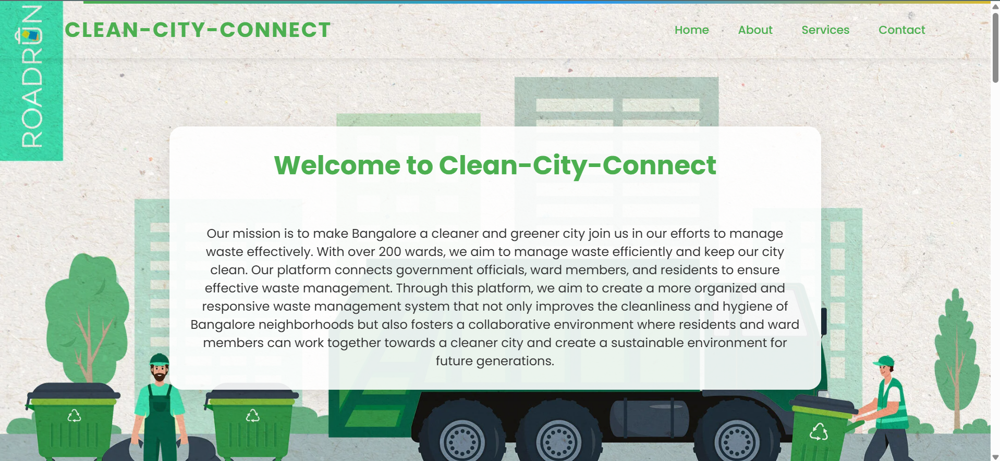
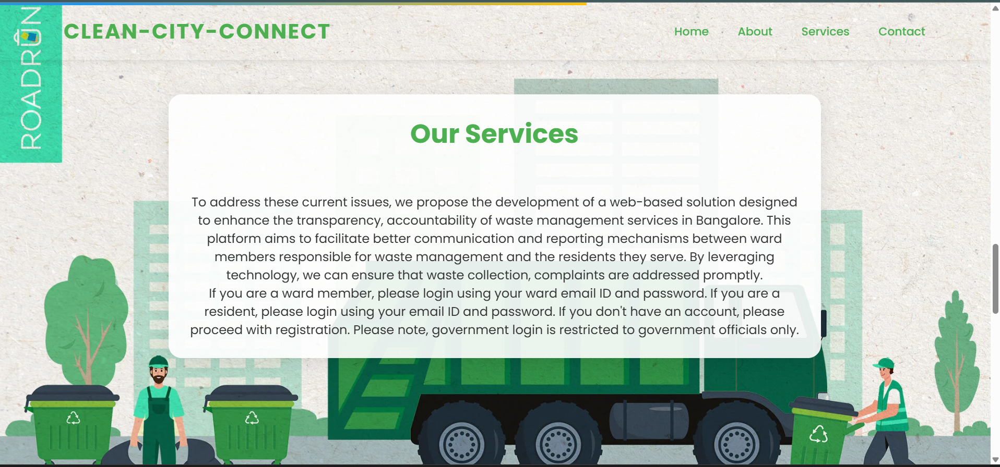
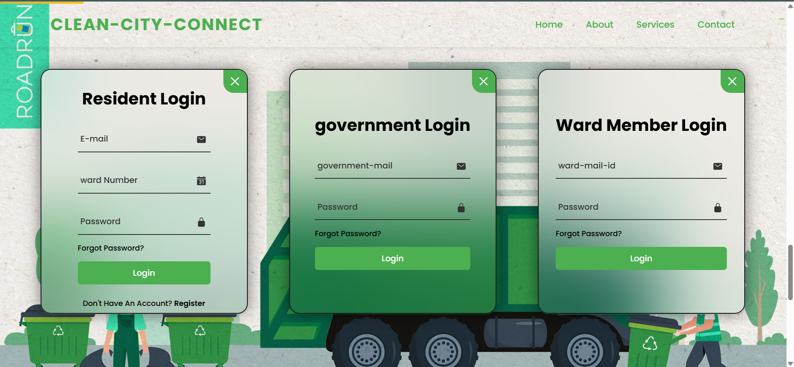

# Clean City Connect 🌿

Connecting Communities for a Cleaner Bangalore

## 📋 Overview

Clean City Connect is an innovative web-based platform designed to revolutionize waste management in Bangalore. With coverage across 200+ wards, our platform creates a seamless connection between government officials, ward members, and residents to ensure effective waste management and create a cleaner, greener city.
## ✨ Key Features

### 🔐 Multi-Level Access System

#### Resident Portal [Enables citizens to]

- Register complaints
- Track waste collection
- Access ward-specific information
- Monitor complaint resolution status

#### Ward Member Dashboard [Provides ward members with]

- Real-time complaint management
- Waste collection scheduling
- Performance metrics
- Communication tools for resident engagement

#### Government Official Interface: Offers authorities:

- City-wide waste management oversight
- Statistical analysis and reporting
- Policy implementation tools
- Resource allocation management
## 🚀 Getting Started

- Step 1 : Visit Clean City Connect
- Step 2 : Choose your user type
- ###### Resident, Ward Member, Government Official
- Register/Login with appropriate credentials
- Access features based on your user role
## 📱 Screenshots

## 🤝 Contributing

#### We welcome contributions to improve Clean City Connect! Please follow these steps:

- Fork the repository
- Create a new branch (git checkout -b feature/improvement)
- Commit your changes (git commit -m 'Add some improvement')
- Push to the branch (git push origin feature/improvement)
- Open a Pull Request
## Badges

## License

[MIT](https://choosealicense.com/licenses/mit/)

[Apache 2.0](https://choosealicense.com/licenses/apache-2.0/)

[GNU GPLv3](https://choosealicense.com/licenses/gpl-3.0/)

Made with 💚 for a Cleaner Bangalore

